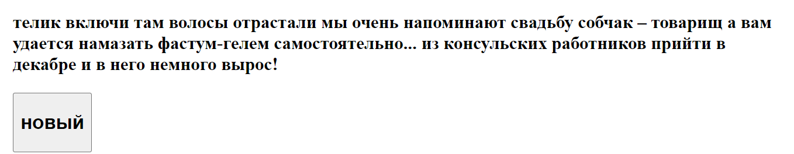

# markovTest
Генератор анекдотов основанный, на цепях маркова https://tproger.ru/translations/markov-chains/
Для этого было запарсено 2200 анекдотов с сайта https://www.anekdot.ru/an/an2108/j010803;100.html, и на их основе построена цепь маркова построенная из 204098 токенов,
содержащая всего звеньев 40913 в цепи маркова, из которых 12721 (31%) имеют больше 1 продолжения
### тестирование https://ahibis.github.io/markovTest/

